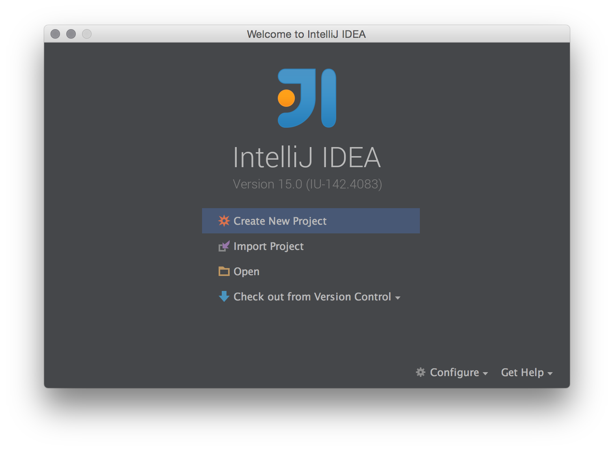
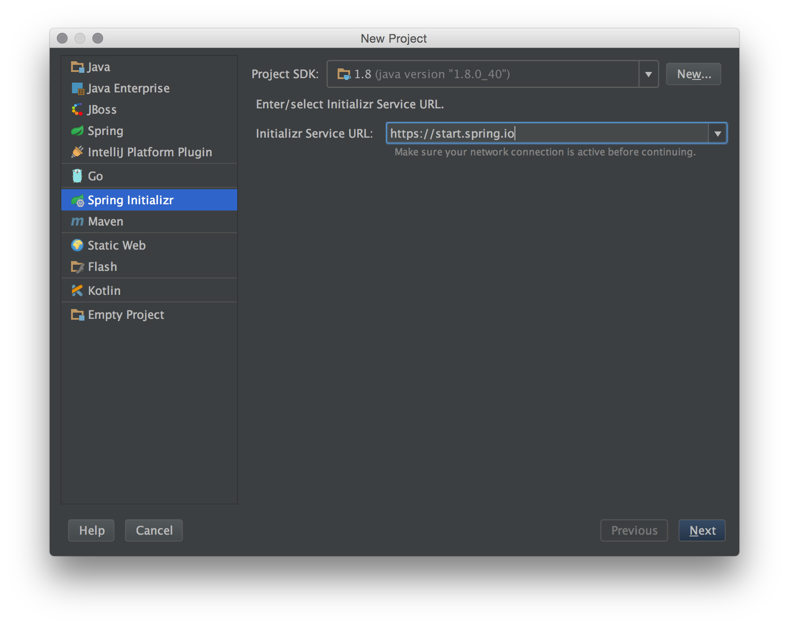
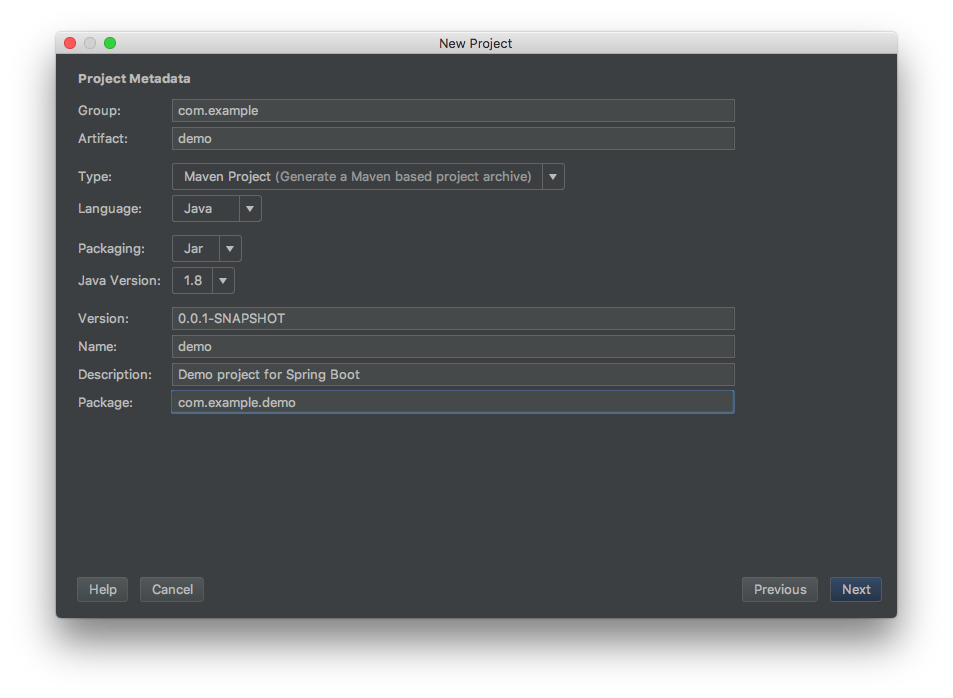
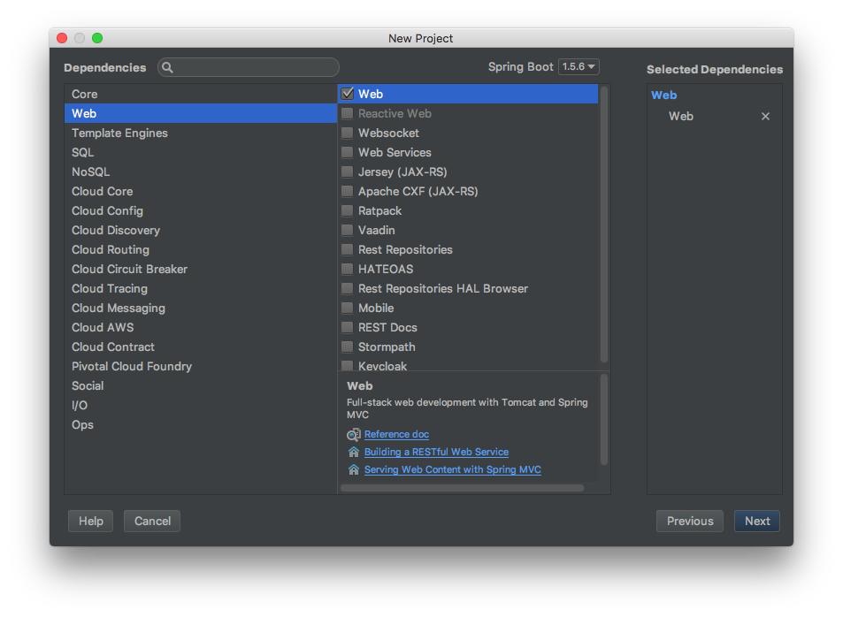
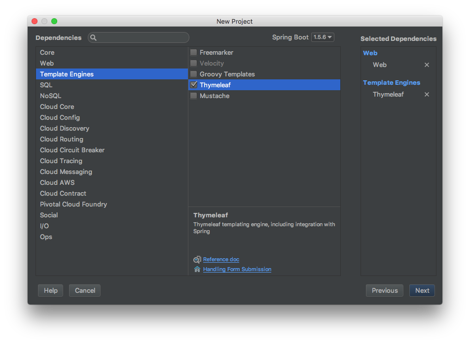

<!-- JS use if these pages are used as githubpages. can be deleted if used elsewhere -->

# Hello Spring
## Tutorial: Build a spring boot application using intellij idea

### Create your new project with intellij
Open up IntelliJ and click on the Create New Project option.

Next, select Spring Initializr from the project type in the left panel, select your Project SDK and then click Next.  The Initializr Service URL should already be populated.    

Next select any Spring Framework dependency your project will require. here you should choose
* Web -> Web
* Template Engines -> Thymeleaf    

Click Next once you’ve selected all your dependencies.

_(heavily inspired by https://patrickgrimard.io/2014/08/14/how-to-build-a-spring-boot-application-using-intellij-idea/)_

_
&copy; clbo@kea.dk
_
