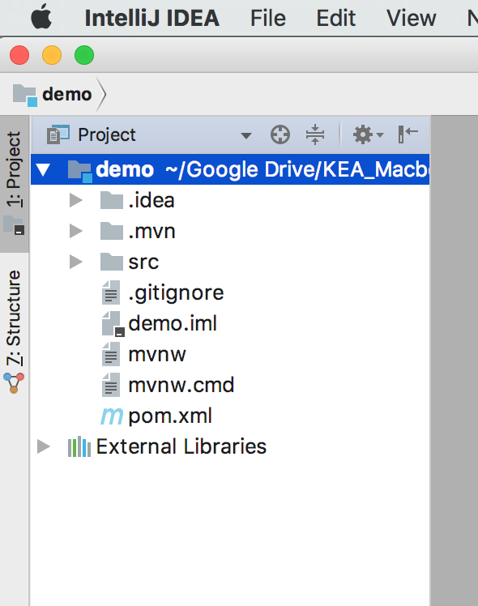
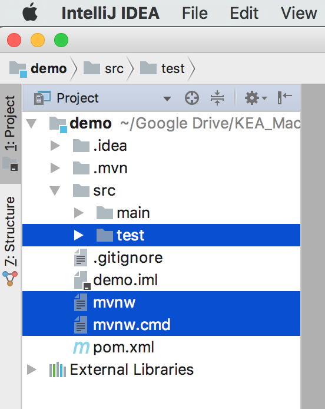
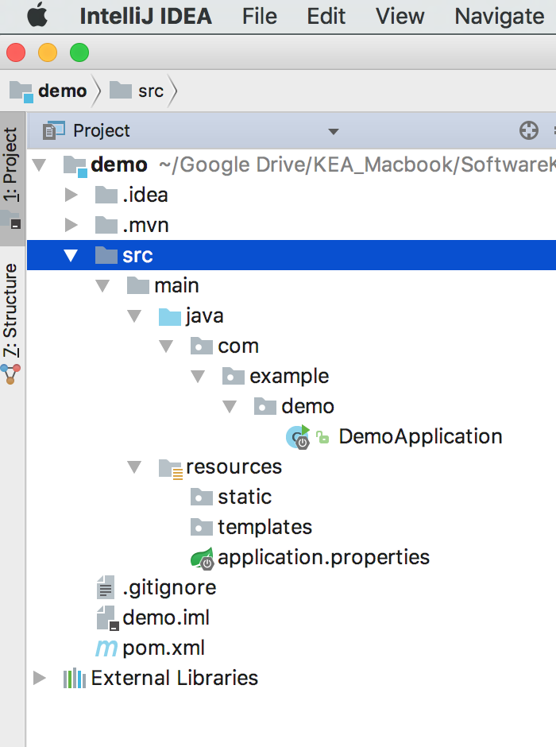
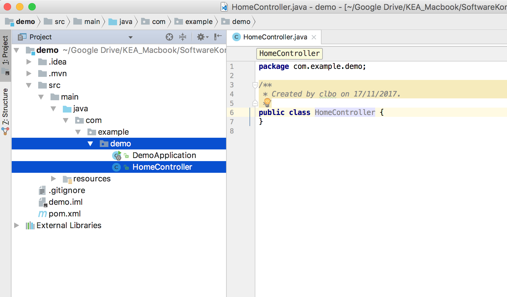
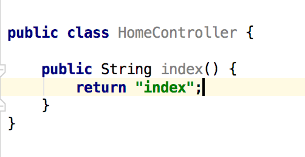
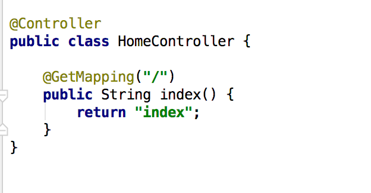
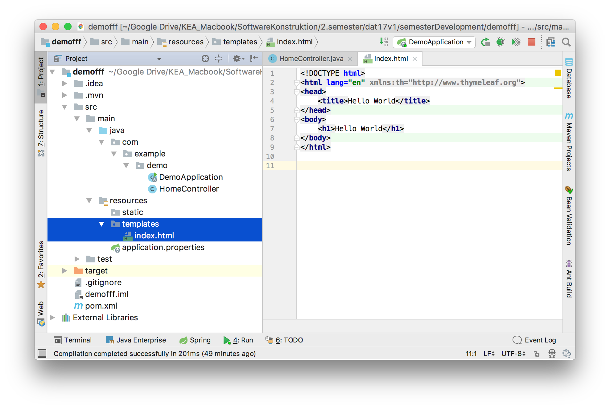
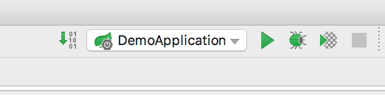
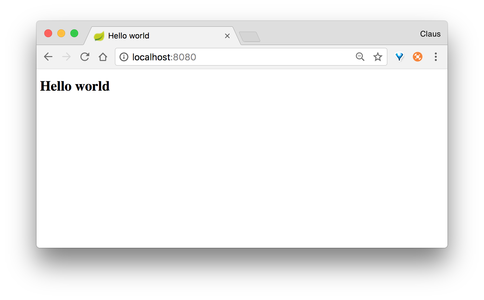

<!-- JS use if these pages are used as githubpages. can be deleted if used elsewhere -->
<script src="https://code.jquery.com/jquery-3.2.1.min.js"></script>
<script src="script.js"></script>
# My First Website

After creating an empty new Spring project in IntelliJ through the _Spring Initializer Template_: [#1 Hello Spring](https://github.com/dat17aSpring/01_hello_spring), you should now create your first _Hello World Website_.    

<sup>_Remember that this is a step by step instruction. It does not explain all the concepts in details. This explanaition you will get from your teacher in class._</sup>

You should now have a folder and file structure that looks something like this:    




If you open your **_src_** folder you will see a **_main_** and a **_test_** folder.    
Delete the:
* **_test_** folder    
And delete the: 
* **_mvnw_** and the **_mvnw.cmd_** files.     

<sup>(you could leave them in the project, but since we are not going to use them we delete them for a better overview)</sup>    




Now you have a project structure that looks like this:    




<!-- Don´t be confused by all the folders. They are packages (or just folders) and is not especially important right now. You can for now see the _demo_ folder as your root folder. -->

## Create a normal java class file
In the demo folder create a class and call it HomeController.java.     
<sub><sup></sup></sub>
* Right click the "demo" folder
* chose: New -> Java Class  
* Name: HomeController
* Kind: Class




### Create an index method in the class
Create a public method called index with a return type of String, and return the string "index".





Add **_@Controller_** above the class definition and **_@GetMapping("/")_** above the method definition.    




## Create an index.html file
* right click **_resource -> template_** folder 
* Choose: **_New -> html file_** 
* Name: index
* Kind: Html 5 file
* Delete the ```` <meta charset="UTF-8"> ````  tag
* Add ````  xmlns:th="http://www.thymeleaf.org"   ```` to the ```` <html lang="en">  ```` tag



Make your code look like the image above. (do your best :))

### Run the application
push the green start button in the upper right corner.



Open your browser and type http://localhost:8080    



_<div align="right">&copy; clbo@kea.dk</div>_

