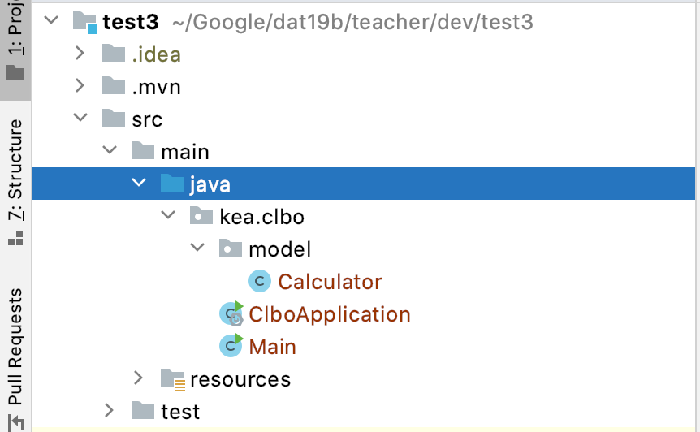
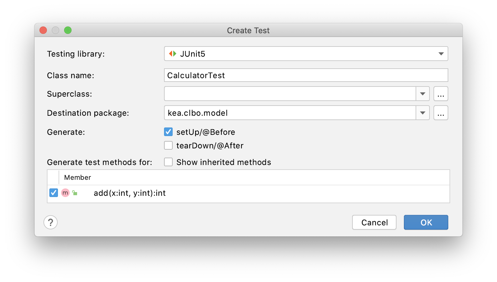
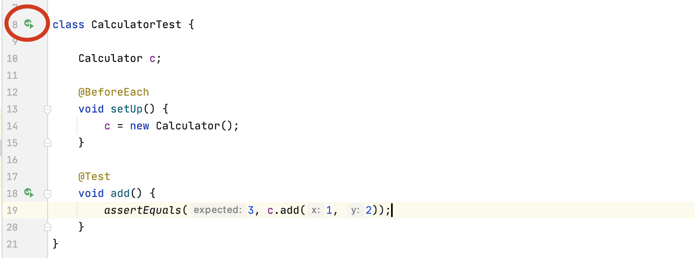
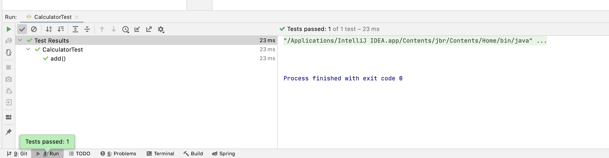
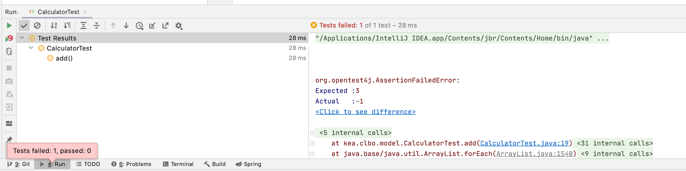

<!-- JS use if these pages are used as githubpages. can be deleted if used elsewhere -->
<script src="https://code.jquery.com/jquery-3.2.1.min.js"></script>
<script src="script.js"></script>


# Tutorial: My First Unit Test

This tutorial is identical to what I have shown you in class about unittest with JUnit.

## Create a Spring Boot Project 
First thing to do is to create a Spring Boot Project using the spring initializer.   
Do not add any dependencies at this point.   


If you look at your projects pom.xml file you should see the following dependencies. 

````
<dependencies>
	<dependency>
	    <groupId>org.springframework.boot</groupId>
	    <artifactId>spring-boot-starter</artifactId>
	</dependency>

	<dependency>
	    <groupId>org.springframework.boot</groupId>
	    <artifactId>spring-boot-starter-test</artifactId>
	    <scope>test</scope>
	    <exclusions>
		<exclusion>
		    <groupId>org.junit.vintage</groupId>
		    <artifactId>junit-vintage-engine</artifactId>
		</exclusion>
	    </exclusions>
	</dependency>
</dependencies>

````
## Setup files
Create a model package and in this package create a file called Calculator.java. Also create a Main.java file with a main() method in it. The Main.java file should be outside the model package, like you can see below.   




## Calculator class

Open your Calculator class and write an add method like the one below.

````
public class Calculator {

    public int add(int x, int y){
        return x + y;
    }
}

````
## Unit Test
### Create a Test Class

Right click in your Calculator class, choose **Generate -> Test**.   
You will now see a Gui like this:



Mark the fields like in the screenshoot. 

In your test folder you will now have a CalculatorTest.java file containing this. 

````
class CalculatorTest {

    @BeforeEach
    void setUp() {
    }

    @Test
    void add() {
    }
}

````

### Write a test

In order to test the methods in your Calculator class you have to create an object of that class. The setUp method is used for this. 

````
class CalculatorTest {
    
    Calculator c;
    
    @BeforeEach
    void setUp() {
	c = new Calculator();
    }

    @Test
    void add() {
    }
}
````


#### The Actual test

In this case we want to test if the add method will return the right result when to parameters are passed in. So if we say **add(1, 2)** it should return **3**

This is done by using a method from the JJunit library called **assertEquals**. assertEquals takes 2 parameters an 'exprected value' (the expected return value when we call the add method) and then the call af the add method.

````
	assertEquals(3, c.add(1, 2));

````

The final test code will loke like this:


````
class CalculatorTest {
    
    Calculator c;
    
    @BeforeEach
    void setUp() {
	c = new Calculator();
    }

    @Test
    void add() {
	assertEquals(3, c.add(1, 2));
    }
}
````

Thats it. You have now written your first test. Now you just need to run it.

#### Run your test

In IntelliJ you can run your unit tests in many different ways. There are many buttons you can push all around the IDE. Ill show you one way. 

At the left of your test code you can see some small 'play' signs. Press the one next to the class definition. 



If you did everything right you should se a screen like this:



Your test passed and you can be sure that your add() method is doing its job correct. 

## Create a mistake and test again

In your Calculator.java files add method you should change the **+** to a ** * ** sign.   

Run your test again. (You can now do it by clicking the normal play sign in the top right of you IDE).



Now your test failed. This is because you made a mistake in your 'real' code. You can also see that it wass expected to give you a 3 as return, but you got a -1. So when a test fails your job is to correct the mistake in your 'real' code, run the test again until it passes.


 

